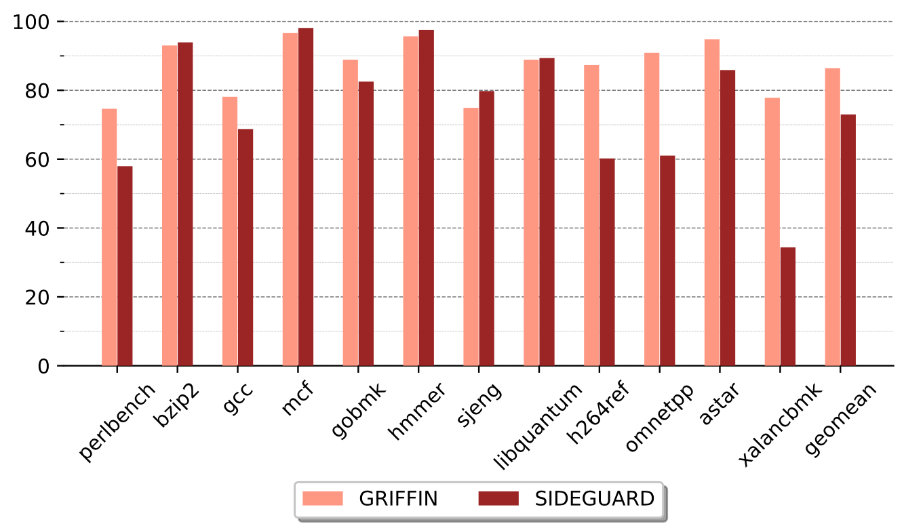

# Artifact Evaluation for SideCar - ACSAC'24

_This documentation contains the steps necessary to reproduce the artifacts for our paper (#131) titled **"SIDECAR: Leveraging Debugging Extensions in Commodity Processors to Secure Software"**.
We use a 24-core Intel i9-13900K at 5.20 GHz to evaluate all the experiments to which we will provide access through HotCRP._

## Project Structure

```bash
.
├── README.md                    # Project overview and instructions
├── benchmarks                   # Benchmark directories and configurations
│   ├── apache                   # Apache HTTPD 2.4.58 with dependencies
│   │   ├── apr-1.7.4
│   │   ├── apr-util-1.6.3
│   │   ├── expat-2.5.0
│   │   ├── httpd-2.4.58
│   │   ├── htdocs
│   │   ├── openssl-1.1.1
│   │   └── pcre-8.45
│   ├── bind                     # BIND 9 DNS server with libuv 1.0.0
│   │   ├── bind9
│   │   └── libuv
│   ├── cpu2006                  # SPEC CPU2006 items
│   │   ├── config               # Configuration files for SPEC CPU2006
│   ├── cpu2017                  # SPEC CPU2017 items
│   │   ├── config               # Configuration files for SPECCPU 2017
│   │   └── cpu2017-patches      # Patches for SPEC CPU2017 benchmarks
│   ├── lighttpd                 # Lighttpd 1.4.76 with OpenSSL 3.0.7
│   │   ├── lighttpd-1.4.76
│   │   ├── lighttpd.conf
│   │   └── openssl-3.0.7
│   ├── memcached                # Memcached 1.6.9 with libevent 2.2.1
│   │   ├── memcached-1.6.9
│   │   └── libevent
│   ├── memtier_benchmark        # Memtier benchmark 2.0.0
│   │   └── memtier_benchmark
│   └── wrk                      # WRK benchmark tool (commit 7f470d1db)
│       └── wrk
├── expected                     # Expected results for comparison
│   ├── expected_figure10.png    # Expected Figure 10
│   ├── expected_figure9.png     # Expected Figure 9
│   └── expected_ripe64.txt      # Expected RIPE64 results
├── sidecar                      # Submodule containing the SideCar project
└── tools                        # Scripts and tools for building and running experiments
    ├── build_bind.sh            # Builds BIND 9 and its dependencies
    ├── build_fig9.py            # Builds and installs everything required for running the Fig. 9 experiments
    ├── build_httpd.sh           # Builds Apache HTTPD and its dependencies
    ├── build_lighttpd.sh        # Builds Lighttpd and its dependencies
    ├── build_memcached.sh       # Builds Memcached and its dependencies
    ├── plot_fig10.py            # Plots and recreates Figure 10 based on the results
    ├── plot_fig9.py             # Plots and recreates Figure 9 based on the results
    ├── run_dnsperf_bind.sh      # Runs DNSPerf against BIND for benchmarking
    ├── run_dromaeo.sh           # Runs Dromaeo benchmarks for browser performance testing
    ├── run_fig10.py             # Runs all experiments for replicating Figure 10
    ├── run_fig9.py              # Runs all experiments for replicating Figure 9
    ├── run_memtier_memcached.sh # Runs Memtier against Memcached for benchmarking
    ├── run_sec6.2.sh            # Runs the RIPE64 experiments for Section 6.2
    ├── run_spec06.sh            # Runs SPEC CPU2006 benchmarks
    ├── run_spec17.sh            # Runs SPEC CPU2017 benchmarks
    ├── run_tab2.sh              # Runs CPU utilization experiments for Table 2
    ├── run_wrk.sh               # Runs WRK for HTTP server benchmarking
    ├── run_wrk_httpd.sh         # Runs WRK against Apache HTTPD for benchmarking
    └── run_wrk_lighttpd.sh      # Runs WRK against Lighttpd for benchmarking
```

## Hardware Dependencies

The SideCar system requires specialized hardware to function correctly. For x86 architecture, it leverages Intel Processor Trace (PT) and specifically the x86 PTWRITE instruction. For AArch64 architecture, it requires CoreSight STM. We provide access to our preconfigured server, which meets these hardware requirements, and reviewers will receive detailed access instructions through HotCRP.

## Software Dependencies

The evaluation of SideCar also requires specific software components and environment settings. The installation paths for SPEC CPU2017 and SPEC CPU2006 need to be set, with their respective environment variables configured as `SPEC17_PATH` for SPEC CPU2017 and `SPEC06_PATH` for SPEC CPU2006. Additionally, Google’s depot tools are required, and the environment path should be set to `DEPOT_TOOLS`. The source code for Chromium is also necessary, and its path must be specified in the `CHROMIUM_SRC` environment variable. While these dependencies are critical for the artifact's operation, our server comes with everything preinstalled and ready to use, streamlining the evaluation process for reviewers.

## Time Constraints

Due to the time limitations for this artifact evaluation,
we have opted to reduce the number of iterations for certain benchmarks.
While our original measurements used 20 iterations to ensure statistical rigor,
for the purposes of this evaluation, we have reduced the iterations to:

- SPEC CPU2017 and SPEC CPU2006: 3 iterations
- Real-world applications (e.g., Apache HTTPD, BIND, Lighttpd, Chromium): 10 iterations
- This adjustment allows for a more feasible evaluation process while still providing reliable results.

## Session Management

We recommend using [tmux](https://github.com/tmux/tmux/wiki) when running the experiments. This will save your session and allow the experiments to continue running without needing to stay connected through SSH. Given the length of the experiments, using `tmux` is crucial as it enables you to detach and reattach to your session at any time, ensuring that the process is not interrupted.

## Installation

- Detailed instructions can be found in the [README.md of our GitHub repository](https://github.com/stevens-s3lab/sidecar).
- Our server comes with everything prebuilt and preinstalled. There is no need to rebuild anything, but if required, you can run the following commands for building and installing SideCar's LLVM 12, SideCar, benchmarks, all software dependencies and testing tools (wrk, memtier_benchmark, etc.):

```bash
./sidecar/tools/install.sh all
python3 tools/build_fig9.py
```

## Evaluation Workflow

### Major Claims

- **(C1): Figure 9**: We find that SIDECFI outperforms LLVM-CFI on real-world applications and that SIDECAR performs reasonably well on SPEC CPU2017.
- **(C2): Figure 10**: We find that SIDEGUARD is slower but on par with GRIFFIN, which requires a large amount of resources.
- **(C3): Table 2**: We show the average CPU utilization for SIDECFI and SIDESTACK and argue that it is considerably lower than GRIFFIN, which requires a minimum of 6 cores.
- **(C4): Section 6.2**: We show that SIDECAR is able to detect a wide range of attacks by testing it against RIPE64, which can imitate up to 2050 attacks.

### Experiments

#### **(E1): [Reproducing Fig. 9; verifying claim C1] [5 human-minutes + 34 compute-hours]**

- Run the following commands:

```bash
cd ~/sidecar-ae
python3 tools/run_fig9.py
```

- The raw results will be saved under `results/raw`, while the parsed results will be in `results/parsed`.
- Run the following command to produce Figure 9:

```bash
python3 tools/plot_fig9.py
```

- The plot will be saved in `results/plots/figure9.pdf`.

- Compare the exported figure to the following one (Figure 9 in the paper):


#### **(E2): [Reproducing Fig. 10; verifying claim C2] [5 human-minutes + 40 compute-minutes]**

- Run the following commands:

```bash
cd ~/sidecar-ae
python3 tools/run_fig10.py
```

- The raw results will be saved under `results/raw`, while the parsed results will be in `results/parsed`.
- Run the following command to produce Figure 10:

```bash
python3 tools/plot_fig10.py
```

- The plot will be saved in `results/plots/figure10.pdf`.

- Compare the exported figure to the following one (Figure 10 in the paper):



#### **(E3): [Reproducing Tab. 2; verifying claim C3] [5 human-minutes + 10 compute-minutes]**

- Run the following commands:

```bash
cd ~/sidecar-ae
./tools/run_tab2.sh
```

- The results will be saved under `results/parsed/cpu-usage.csv` and `results/parsed/cpu-usage.md` in a more human-readable format.
- Compare the table in `results/parsed/cpu-usage.md` to the following table (Table 2 in the paper):

| **Benchmark** | **SideCFI** | **SideStack** |
| ------------- | ----------- | ------------- |
| perlbench     | 97.02%      | 52.81%        |
| bzip2         | 0.48%       | 6.31%         |
| gcc           | 16.83%      | 49.85%        |
| mcf           | 0.57%       | 1.53%         |
| gobmk         | 16.42%      | 28.15%        |
| hmmer         | 0.48%       | 0.50%         |
| sjeng         | 18.14%      | 12.75%        |
| libquantum    | 0.48%       | 4.66%         |
| h264ref       | 44.96%      | 11.17%        |
| omnetpp       | 99.93%      | 46.63%        |
| astar         | 8.61%       | 8.15%         |
| xalancbmk     | 98.96%      | 61.96%        |
| **geomean**   | **8.36%**   | **11.54%**    |

- Note: The results have been updated to reflect the SPEC CPU2006 benchmarks instead of the SPEC CPU2017 benchmarks shown in the paper. These results will be included in the final version of the paper.

#### **(E4): [Reproducing Sec. 6.2; verifying claim C4] [2 human-minutes + 4 compute-minutes]**

- Run the following commands:

```bash
cd ~/sidecar-ae
./tools/run_sec6.2.sh
```

- The raw RIPE64 logs are stored in `results/raw` under the latest `RunXXX` folder.
- The finals results will be saved under `results/parsed/ripe64_results.txt`.
- Compare the results to the expected results in `expected/expected_ripe64.txt`.
